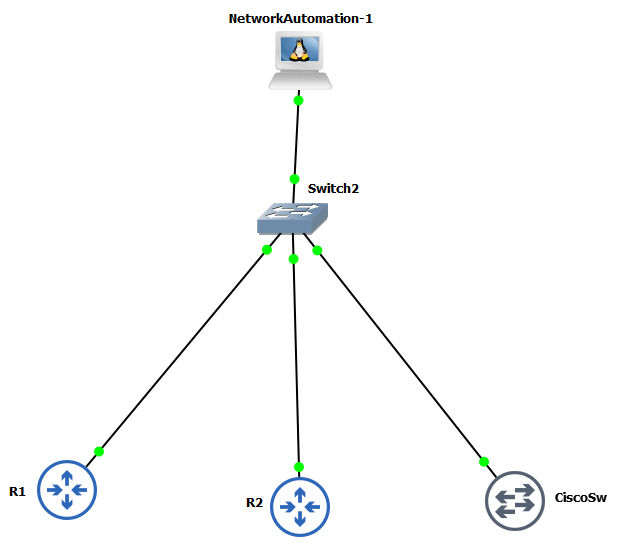

# Python Cisco Network Automation Lab

## Overview

This lab demonstrates basic network automation of Cisco IOS devices using **Python**, **Netmiko**, **Paramiko**, and **PyYAML** in a GNS3 environment.

The goal is to automate common network engineering tasks such as:

- Connecting to multiple Cisco devices over SSH
- Backing up running configurations
- Reading device information from a YAML inventory
- Creating VLANs on a Cisco switch
- Verifying configuration changes
- Creating a post-change configuration backup

## Lab Topology

The automation node connects to all Cisco devices through a dedicated management network.



### Devices

| Device | Role | Management IP |
|---|---|---|
| NetworkAutomation-1 | Python automation node | 10.10.10.10 |
| R1 | Cisco IOS Router | 10.10.10.11 |
| R2 | Cisco IOS Router | 10.10.10.12 |
| CiscoSw / SW1 | Cisco IOS Switch | 10.10.10.21 |

All devices are connected to the same management subnet:

```text
10.10.10.0/24
```

## Technologies Used

- GNS3
- Cisco IOS
- Python 3.8.5
- Netmiko 3.3.3
- PyYAML 5.3.1
- SSH
- YAML

## Project Structure

```text
Python-Cisco-Automation/
├── devices.yml
├── backup_configs.py
├── configure_vlan.py
├── topology.png
├── backups/
└── README.md
```

## Device Inventory

Device connection information is stored in `devices.yml`.

```yaml
devices:
  - name: R1
    device_type: cisco_ios
    host: 10.10.10.11
    username: admin

  - name: R2
    device_type: cisco_ios
    host: 10.10.10.12
    username: admin

  - name: SW1
    device_type: cisco_ios
    host: 10.10.10.21
    username: admin
```

Passwords are **not stored in the repository**. The scripts request the password interactively using Python `getpass`.

## 1. Configuration Backup Automation

`backup_configs.py` connects to every device listed in `devices.yml` and collects the running configuration.

The script:

1. Loads the YAML device inventory.
2. Prompts for the device password.
3. Connects to each device using Netmiko.
4. Detects the device hostname from the CLI prompt.
5. Executes `show running-config`.
6. Saves each configuration to the `backups/` directory.
7. Adds a timestamp to every backup filename.

```

## 2. VLAN Configuration Automation

`configure_vlan.py` automates VLAN creation on the Cisco switch.

The script:

1. Connects to `SW1`.
2. Prompts for a VLAN ID.
3. Prompts for a VLAN name.
4. Sends the VLAN configuration to the switch.
5. Runs `show vlan brief`.
6. Verifies that the VLAN exists.
7. Reports `SUCCESS` or `FAILED`.
8. Creates a post-change running configuration backup.


```

## Security Notes

- Device passwords are not hardcoded in Python or YAML files.
- Credentials are entered interactively using `getpass`.
- The Cisco images used in this GNS3 lab are older IOS images, so SSH compatibility may differ from modern production devices.
- No production credentials, public IP addresses, or customer configurations are included in this repository.


## Author

**Miloš Petković**

Network Engineer  
GitHub portfolio: Network & Automation Labs
